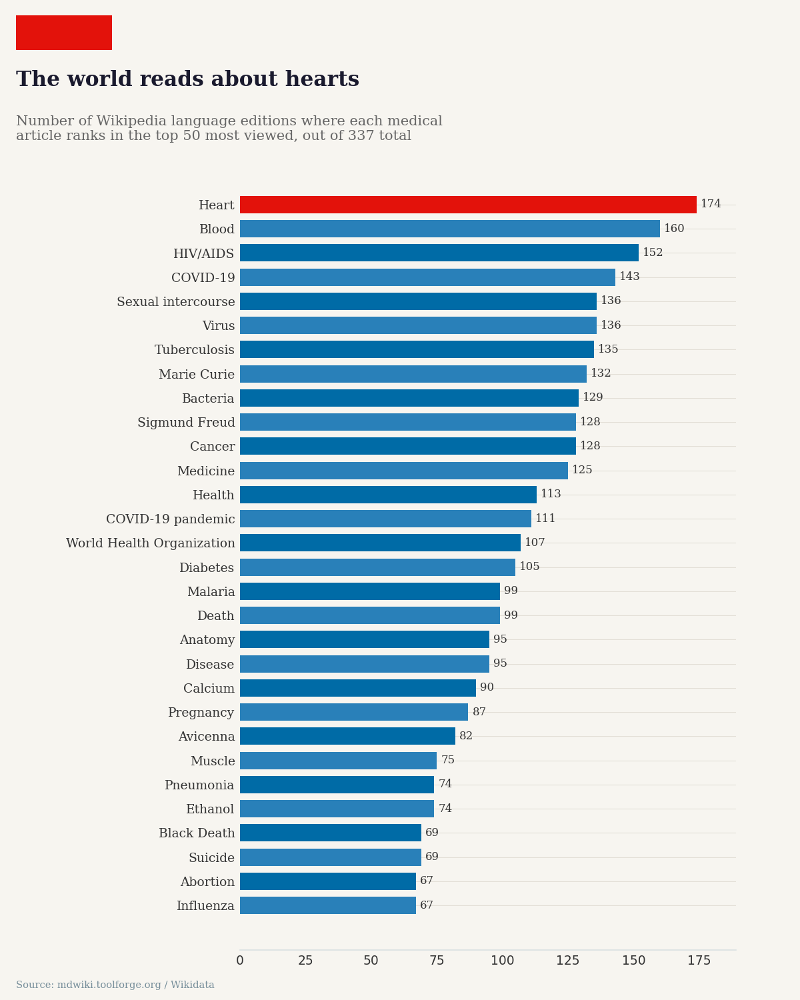
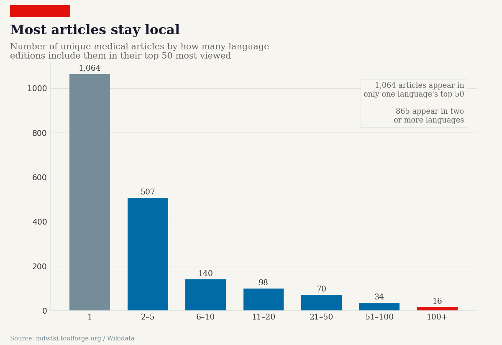
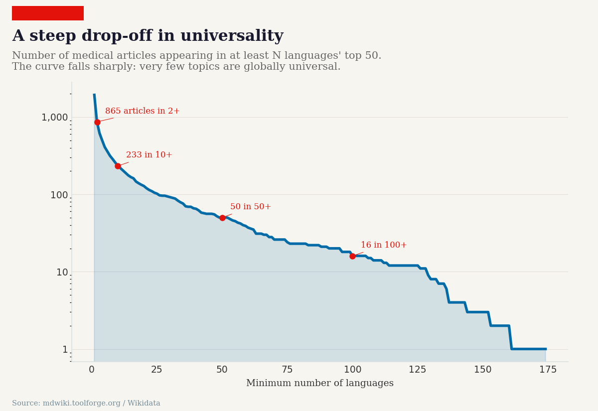
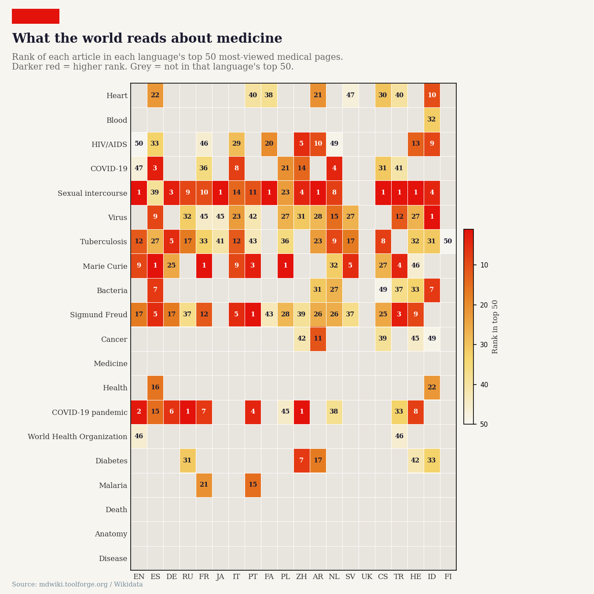
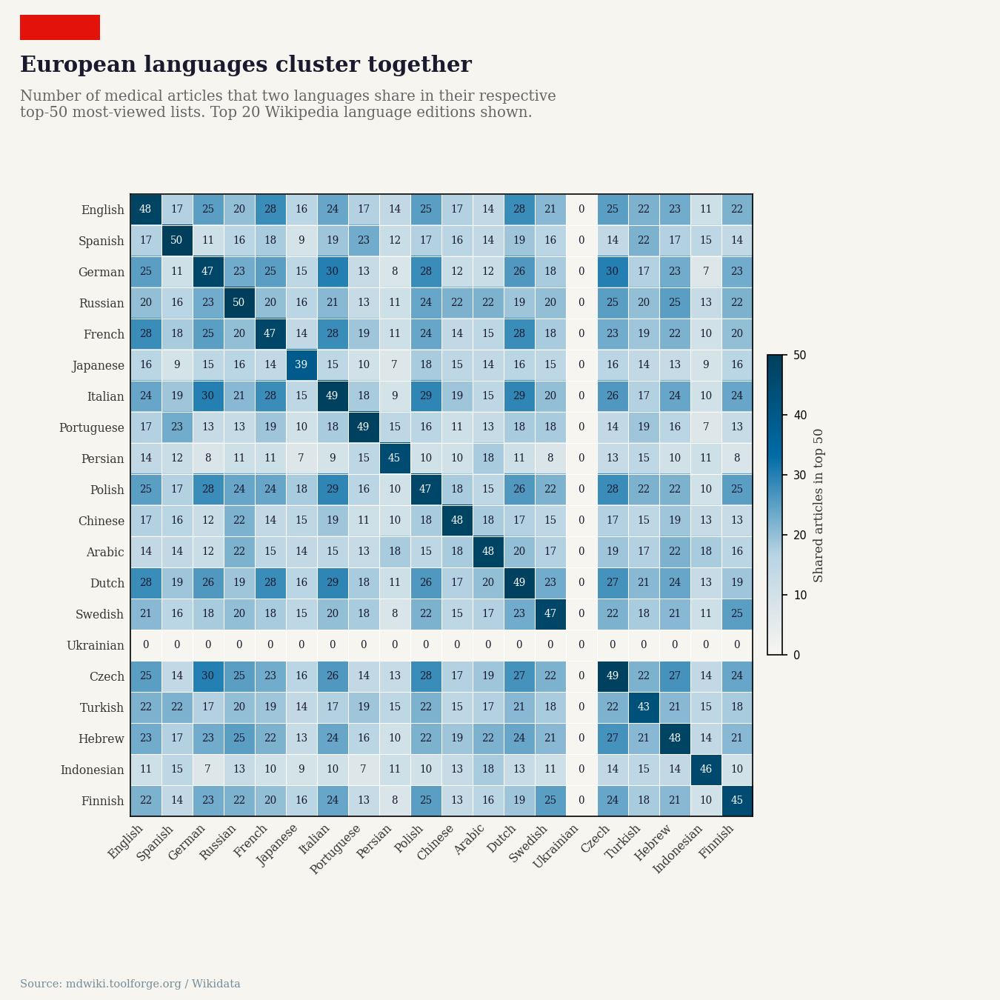
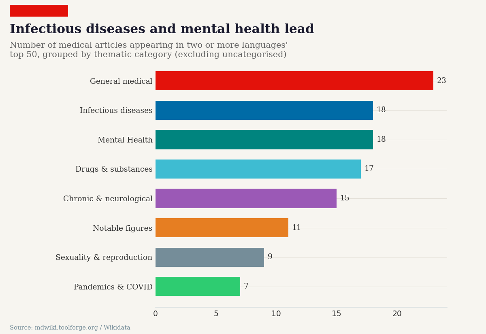
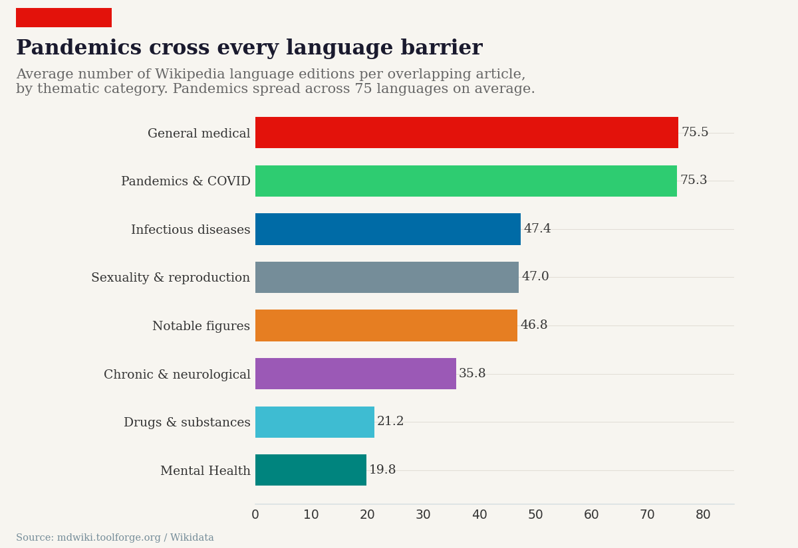

# Wikipedia Medical Articles: Cross-Language Overlap Analysis

**Research question:** What are the top 50 most-read medical articles across all 337 Wikipedia language editions, and how much overlap exists between them?

This project analyzes pageview data from [WikiProject Medicine](https://mdwiki.toolforge.org/views/index.php?sub_dir=users-agents) to find the most universally read medical articles across all Wikipedia languages. It uses [Wikidata](https://www.wikidata.org/) to unify article identities across languages, enabling direct comparison of reading interests worldwide.

## Key Findings

- **1,929 unique medical articles** appear in the top 50 of at least one language edition
- **865 articles (45%)** appear in two or more languages' top 50
- **"Heart"** is the single most universal medical article, appearing in **174 out of 337** language editions' top 50
- Only **16 articles** appear in 100+ languages' top 50 — truly global medical interests
- **Pandemics & COVID** articles have the highest average language spread (75 languages per article)
- **European languages cluster tightly** in their reading patterns, while Persian and Japanese show more unique interests
- **Mental health and drug-related articles** are popular but concentrated in larger Wikipedias rather than spreading universally

## Visualizations

All charts are styled after *The Economist*.

### Top 30 most universal medical articles


### Overlap distribution


### Cumulative universality curve


### Article × Language heatmap (top 20 × 20)


### Language pair overlap matrix


### Thematic category breakdown


### Average language spread by category


## Methodology

1. **Data collection**: Fetched the top 50 most-viewed medical articles for each of the 337 Wikipedia language editions from the [mdwiki Toolforge dashboard](https://mdwiki.toolforge.org/views/index.php?sub_dir=users-agents) (user/agent pageviews, 2016–2025).

2. **Wikidata unification**: Queried the [Wikidata API](https://www.wikidata.org/w/api.php) to map each local-language article title to its Wikidata QID, enabling cross-language comparison. Achieved a **97% match rate** across 12,037 article entries.

3. **Overlap analysis**: Built a unified article map (QID → languages) to identify which articles appear in multiple languages' top 50 lists, and calculated pairwise language overlap.

4. **Visualization**: Generated Economist-style charts using matplotlib and seaborn.

## Repository Structure

```
├── README.md
├── code/
│   ├── 01_fetch_all_languages.py   # Stage 1: Fetch top-50 articles for all 337 languages
│   ├── 02_wikidata_unification.py  # Stage 2: Query Wikidata for cross-language mapping
│   ├── 03_analyze_overlap.py       # Stage 3: Overlap analysis + basic visualizations
│   └── 04_economist_charts.py      # Stage 4: Economist-style chart generation
├── data/
│   ├── all_languages_overlap_analysis.csv  # Full overlap data (1,929 articles)
│   └── all_languages_summary.json          # Summary statistics + top 100 articles
└── images/
    ├── eco_fig1_universal_articles.png
    ├── eco_fig2_overlap_distribution.png
    ├── eco_fig3_cumulative.png
    ├── eco_fig4_heatmap.png
    ├── eco_fig5_language_pairs.png
    ├── eco_fig6_categories.png
    └── eco_fig7_category_spread.png
```

## How to Reproduce

```bash
# Stage 1: Fetch data (takes ~10 min, makes ~337 API calls)
python3 code/01_fetch_all_languages.py

# Stage 2: Wikidata unification (takes ~15 min, makes ~337 API calls)
python3 code/02_wikidata_unification.py

# Stage 3: Analysis and basic charts
python3 code/03_analyze_overlap.py

# Stage 4: Economist-style charts
pip install matplotlib seaborn pandas
python3 code/04_economist_charts.py
```

## Data Sources

- **Pageview data**: [WikiProject Medicine Dashboard](https://mdwiki.toolforge.org/views/index.php?sub_dir=users-agents) (mdwiki.toolforge.org)
- **Article unification**: [Wikidata API](https://www.wikidata.org/w/api.php) (`wbgetentities` with `sites` and `titles` parameters)

## License

Data sourced from Wikipedia/Wikidata (CC BY-SA 4.0). Code in this repository is MIT licensed.
